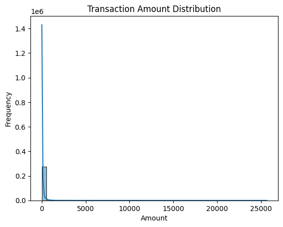
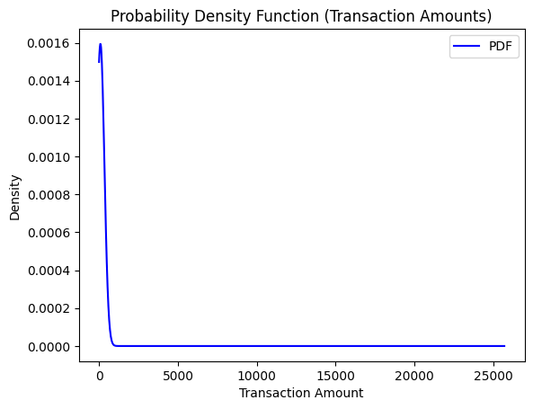
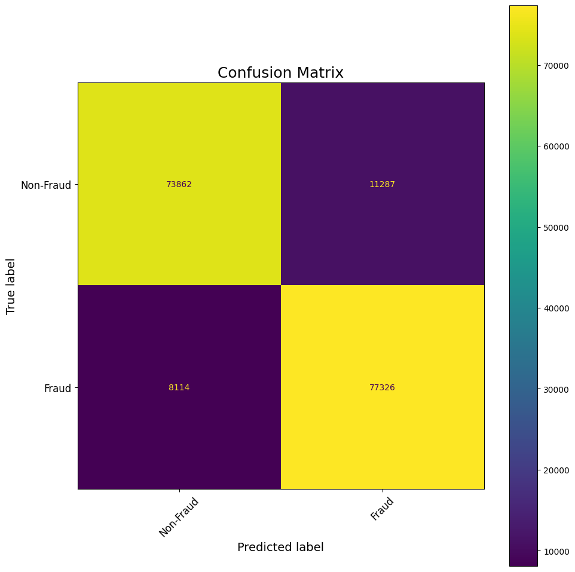

# 💳 Credit Card Fraud Detection using Machine Learning  

## 📌 Project Overview  
This project focuses on detecting fraudulent credit card transactions using various machine learning models. Fraud detection is a highly imbalanced classification problem because fraudulent cases are much rarer than legitimate ones. The goal is to build models that can accurately identify fraud while minimizing false alarms.  

## 🎯 Objectives  
- Analyze the dataset distribution.  
- Apply statistical and visualization techniques to understand data patterns.  
- Train and evaluate machine learning models for fraud detection.  
- Compare model performance using metrics such as Accuracy, Precision, Recall, and F1-score.  

## 📂 Dataset  
The dataset used in this project is available on [Kaggle](https://www.kaggle.com/datasets/mlg-ulb/creditcardfraud).(https://www.kaggle.com/code/parveenkaur17/credit-card-fraud-detection-balanced-ml/input)).  
It contains **284,807 transactions** with **492 frauds (0.17%)**.  

## ⚙️ Methods & Approach  
1. **Data Preprocessing**  
   - Handling class imbalance (undersampling/oversampling).  
   - Normalization of transaction amount.  

2. **Exploratory Data Analysis (EDA)**  
   - Distribution of transaction amounts.  
   - Probability density, cumulative distribution, and correlation analysis.  

3. **Model Training**  
   - Logistic Regression  
   - Random Forest  
   - Support Vector Machine (SVM)  
   - Neural Networks  

4. **Evaluation Metrics**  
   - Confusion Matrix  
   - Precision, Recall, F1-score  
   - ROC Curve & AUC  

## 📊 Results & Visualizations  
Here are some key visualizations from the results:  

- Transaction Amount Distribution  
    

- Probability Density Function  
    

- Confusion Matrix  
    

*(More result plots can be found in the `results/` folder.)*  

## 🚀 How to Run  
1. Clone the repository:  
   ```bash
   git clone https://github.com/kaurparveen1719-creator/credit-card-fraud-detection-ml.git
   cd credit-card-fraud-detection-ml

